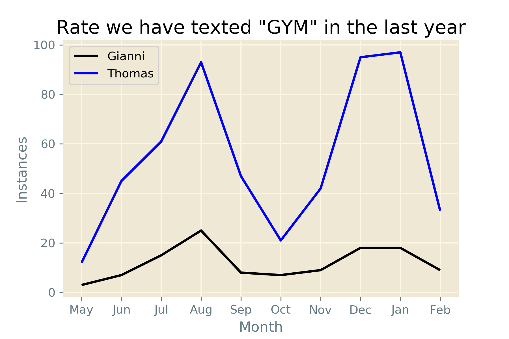

# TextRateAnalyzer
 
This script will take a CSV file of a saved conversation from iMazing and allow the user to search that file for a word or string of text. It will then output a graph of each persons rate of using that string in the past year, by month.

